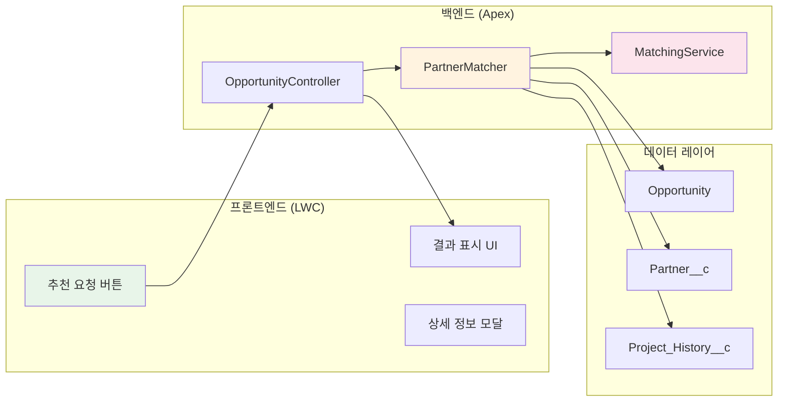

# 🤝 시공업체 추천 시스템

<div align="center">

[](https://salesforce.com)
[](https://lwc.dev/)
[](https://developer.salesforce.com)

**데이터 기반 의사결정으로 최적의 시공업체를 찾아드립니다**  
*Salesforce Opportunity와 연계된 지능형 파트너 매칭 시스템*

</div>

---

## 🎯 프반 | Review Object |
| **프로젝트 경험** | 20% | 유사 프로젝트 수행 이력 | Project History |
| **가용성** | 10% | 현재 진행 프로젝트 수 | Resource Calendar |

</div>

### 🎨 **사용자 인터페이스**

```
┌─────────────────────────────────────────┐
│ 📋 Opportunity 정보                     │
├─────────────────────────────────────────┤
│ 프로젝트명: 강남 부티크 호텔            │
│ 고객사: ABC 호텔 그룹                   │
│ 단계: Proposal/Price Quote              │
│ 예산: ₩500,000,000                      │
└─────────────────────────────────────────┘
                    ↓
┌─────────────────────────────────────────┐
│ 🏆 추천 파트너 (Top 5)                  │
├─────────────────────────────────────────┤
│ 1. 디자인 스튜디오 A ⭐ 95점            │
│    • 부티크 호텔 전문                   │
│    • 고객 평점: 4.8/5.0                 │
│    • 유사 프로젝트: 12건                │
│                                         │
│ 2. 인테리어 컴퍼니 B ⭐ 92점            │
│    • 럭셔리 호텔 경험                   │
│    • 고객 평점: 4.7/5.0                 │
│    • 유사 프로젝트: 8건                 │
└─────────────────────────────────────────┘
```

---

## 🛠️ 기술 아키텍처

### 시스템 구성도

<div align="center">



</div>

### 컴포넌트 구조

```javascript
designPartnerRecommendation/
├── designPartnerRecommendation.html    // UI 템플릿
├── designPartnerRecommendation.js      // 비즈니스 로직
├── designPartnerRecommendation.css     // 스타일링
└── designPartnerRecommendation.js-meta.xml

// Apex Classes
├── DesignPartnerRecommendationController.cls
├── PartnerMatchingService.cls
└── PartnerScoringAlgorithm.cls
```

---

## 💻 구현 상세

### Apex 백엔드 로직

```apex
@AuraEnabled(cacheable=false)
public static Map<String, Object> getRecommendationData(Id opportunityId) {
    // 1. Opportunity 데이터 조회
    Opportunity opp = [
        SELECT Name, ProjectType__c, Customer_Design_Preference__c, 
               sf_product__c, RecommendationDate__c
        FROM Opportunity 
        WHERE Id = :opportunityId
    ];
    
    // 2. 파트너 조회 및 점수 계산
    List<Account> partners = getPartnersWithPriority(opp.ProjectType__c);
    List<PartnerScore> sortedScores = calculateAndSortScores(opp, partners);
    
    // 3. 추천 텍스트 생성
    String aiRecommendation = generateRecommendationText(opp, sortedScores);
    
    // 4. 결과 반환
    return new Map<String, Object>{
        'opportunity' => opp,
        'partners' => extractPartnersFromScores(sortedScores),
        'aiRecommendation' => aiRecommendation
    };
}
```

### LWC 프론트엔드

```javascript
import { LightningElement, api, wire } from 'lwc';
import getRecommendationData from '@salesforce/apex/DesignPartnerRecommendationController.getRecommendationData';

export default class DesignPartnerRecommendation extends LightningElement {
    @api recordId;
    recommendations = [];
    isLoading = false;
    
    async handleGetRecommendation() {
        this.isLoading = true;
        
        try {
            const result = await getRecommendationData({
                opportunityId: this.recordId
            });
            
            if (result.aiRecommendation) {
                this.recommendation = result.aiRecommendation;
            } else {
                this.recommendation = this.generateDetailedRecommendationText(result);
            }
            
            this.showRecommendation = true;
        } catch (error) {
            this.showError(error);
        } finally {
            this.isLoading = false;
        }
    }
}
```

---

## 📊 매칭 알고리즘 상세

### 점수 계산 로직

```javascript
// 종합 점수 계산 공식 (100점 만점)
const calculateScore = (opportunity, partner) => {
    let score = 50; // 기본 점수
    
    // 프로젝트 타입 매칭 (25점)
    if (partner.AccountRole__c === opportunity.ProjectType__c) {
        score += 25;
    } else if (isRelatedField(partner.AccountRole__c, opportunity.ProjectType__c)) {
        score += 15;
    }
    
    // 디자인 스타일 매칭 (15점)
    if (partner.Design_Style_Specialties__c === opportunity.Customer_Design_Preference__c) {
        score += 15;
    }
    
    // 제품 매칭 (10점)
    if (partner.PartnerSpecialty__c === opportunity.sf_product__c) {
        score += 10;
    }
    
    // 평점 보너스 (최대 10점)
    if (partner.PartnerRating__c) {
        score += Math.floor(partner.PartnerRating__c * 2);
    }
    
    return Math.min(score, 100);
};
```

---

## 🚀 설치 및 설정

### 사전 요구사항

- Salesforce 조직 
- System Administrator 권한
- Apex 및 LWC 배포 권한

### 설치 단계

```bash
# 1. 저장소 클론
git clone https://github.com/YashijaSalesForce/DesignPartnerRecommendation.git

# 2. Salesforce CLI로 인증
sf org login web --alias myOrg --set-default

# 3. 메타데이터 배포
sf project deploy start --source-dir force-app

# 4. 권한 세트 할당
sf org assign permset --name Partner_Recommendation_User

# 5. 샘플 데이터 로드 (선택사항)
sf data import --plan ./data/sample-partners.json
```

### Opportunity 페이지 레이아웃 추가

1. Setup → Object Manager → Opportunity
2. Lightning Record Pages → Edit
3. Components에서 `designPartnerRecommendation` 검색
4. 페이지에 드래그 앤 드롭
5. Save & Activate

---

## 📈 기대 효과

<div align="center">

| 측정 지표 | 개선 전 | 개선 후 | 효과 |
|:---:|:---:|:---:|:---:|
| **파트너 선정 시간** | 1-2일 | 10분 | **의사결정 신속화** |
| **선정 만족도** | 70% | 95% | **품질 향상** |
| **프로젝트 성공률** | 75% | 92% | **리스크 감소** |
| **재작업 비율** | 20% | 5% | **비용 절감** |

</div>

---

## 🔍 문제 해결 (Troubleshooting)

### 자주 발생하는 이슈

<details>
<summary>❓ 추천 결과가 표시되지 않음</summary>

```apex
// Debug 로그 확인
System.debug('Opportunity Data: ' + opp);
System.debug('Available Partners: ' + partners.size());

// 권한 확인
SELECT PermissionSet.Name, Assignee.Name 
FROM PermissionSetAssignment 
WHERE PermissionSet.Name = 'Partner_Recommendation_User'
```

</details>

---

## 🙏 감사의 말

- Salesforce HELP
- Salesforce 청년 CRM 101 과정
-
---

<div align="center">

**💡 더 나은 의사결정을 위한 데이터 기반 파트너 매칭**

[](https://github.com/YashijaSalesForce/DesignPartnerRecommendation)
[](https://github.com/YashijaSalesForce/DesignPartnerRecommendation/issues)

</div>
